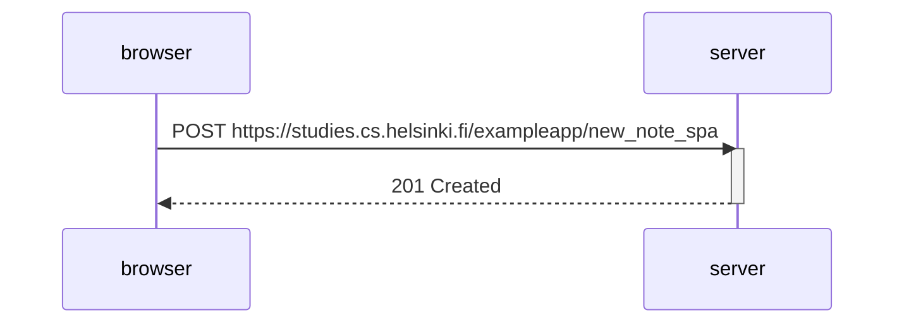

## Description
Network diagram when submitting a message in the spa.

No redirect is needed; spa.js takes the note submitted by the user and updates the html. Then, it sends the note to the server via a POST request.

